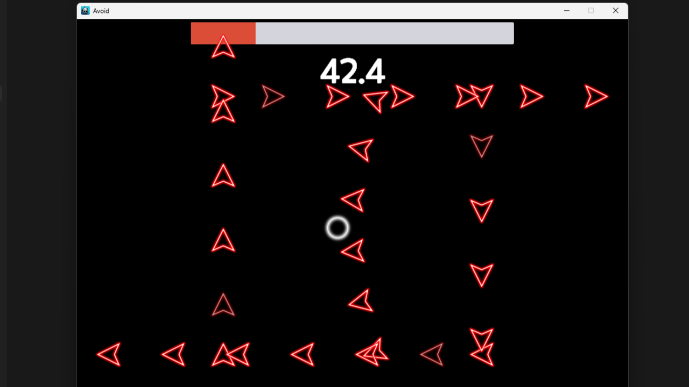
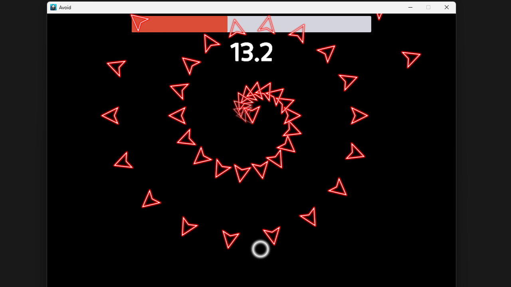
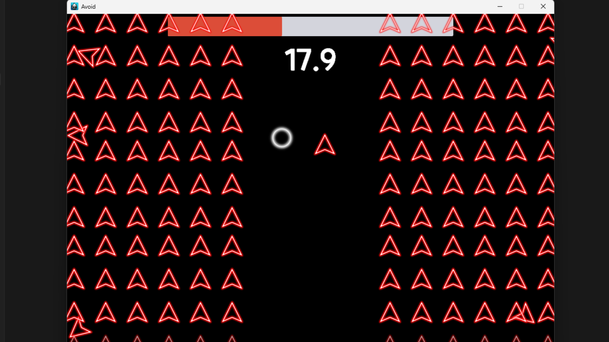

# Avoid

<aside>

> 📌 모바일을 타켓팅 하여 만든 닷지류 게임입니다. 다양한 패턴들을 피해 오래 생존하는것이 목표입니다!

</aside>

  
  
    

🔗 [유튜브](https://www.youtube.com/watch?v=789LNSwjU-s)  
🔗 [문서](https://abaft-yarn-52e.notion.site/Avoid-1e6c32f2552880a88033f40a8fefe495?pvs=74)  

| 항목 | 내용 |
| --- | --- |
| 🎮 게임 이름 | **Blade X** |
| 🕹 장르 | 탄막, 닷지 |
| 🛠 사용 기술 | Cocos2d-x, c++ |
|
| 📅 개발 기간 | 2025.04.19~05.01 |
| 👥 개발 인원 | 개발 1명 |

## ✅ 수행한 역할

### 🔹 시스템 개발
- `ArrowPool`을 활용하여 탄막 오브젝트를 효율적으로 관리
- `ArrowPattern`을 추상 클래스로 구성하고 `Pattern Queue`를 통해 다양한 패턴 조합 가능하게 구현
- `MVC 패턴`을 도입하여 UI 모듈화 및 유지보수성 향상
- `Delegate` 시스템을 함수 객체 및 템플릿을 활용하여 직접 구현

### 🔹 콘텐츠 개발
- 총 8종의 탄막 패턴(ArrowPattern) 구현
- `ActionInterval`을 이용한 카메라 흔들림 효과 구현
- `BloodScreen`, `TimeCount`, `GameOver` 등 주요 UI 기능 개발
- `9-Slice`를 활용해 HealthBar의 텍스처 깨짐 문제 해결

### 🔹 기타 시스템
- Android Studio를 통해 실제 기기로 빌드 및 테스트 진행
- APK 파일 생성 과정 경험

---

### 🔹 주요 시스템 구성

#### ✅ 탄막 패턴 시스템
- `ArrowPattern`을 추상 클래스로 설계하여 다양한 탄막을 유연하게 추가 가능.
- 패턴은 `Pattern Queue`를 통해 연속적으로 실행되며 조합이 용이함.

#### ✅ 오브젝트 풀링
- `ArrowPool`을 통해 생성 비용이 높은 오브젝트를 재사용하며 성능 최적화.

#### ✅ UI 및 이벤트 처리
- `MVC 구조`를 도입하여 UI 계층을 분리.
- 게임 내 다양한 UI 요소(BloodScreen, GameOver 등)와 HUD 구성
- `Delegate` 시스템으로 유연한 이벤트 바인딩 처리.

#### ✅ 빌드 및 배포
- Android Studio와 Gradle을 사용해 실제 APK 파일을 생성.
- 디바이스 테스트를 통해 런타임 오류를 해결하고 안정성 확보.

---

